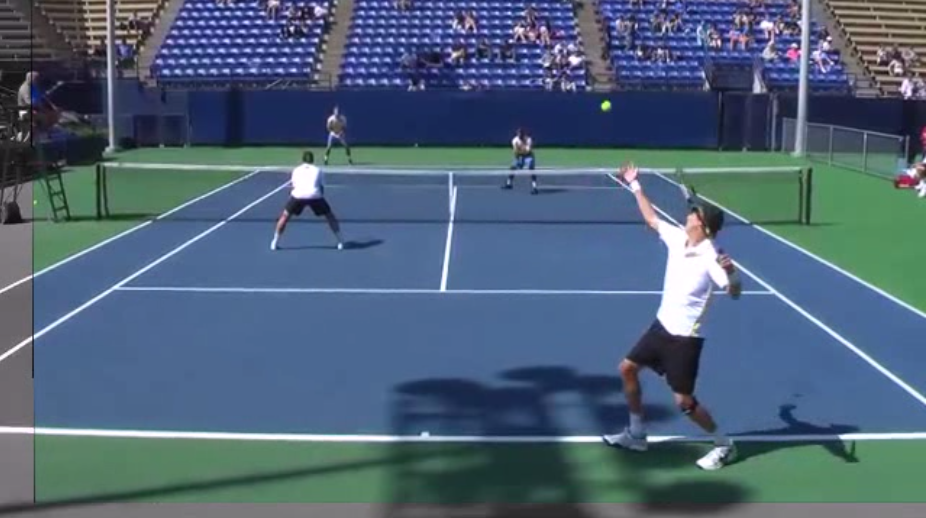
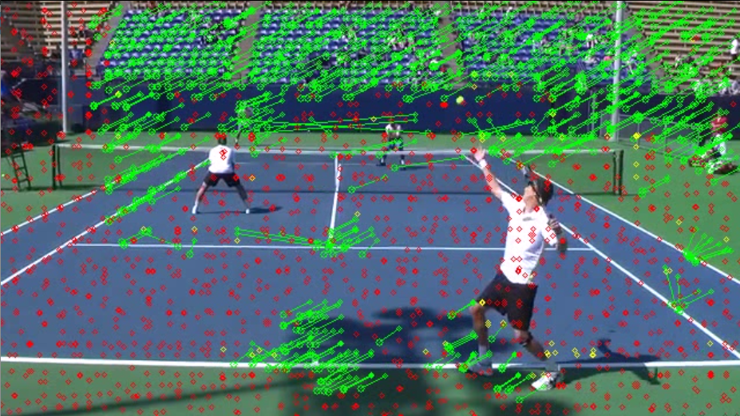

Automatic Video Stabilizer
================
This code is part of a semester project by Lars Mescheder at EPFL in 2015. It contains implementations of four different stabilization techniques as well as an MSER detection and tracking system.
It is distributed under the MIT license, so you can use it free of charge as long as you include a copy of the copyright notice in all copies or substantial portions of the software (see the license file for details).

Requirements
------------------
This software requires

- boost 1.54
- OpenCV 2.4
- qmake for building the project
- doxygen for building the documentation

Usage
--------
You can use the program by starting the binary `stabilizer` with the command line options

`<path to video> <path to config file> <path to output folder>`

See the `config` folder for examples of valid config files. 

Experience shows that for most videos the patch stabilizer works best.

To automatically generate the documentation use the command `doxygen Doxyfile`.

Results
---------
Sample results from the patch stabilizer:

Visualization:

